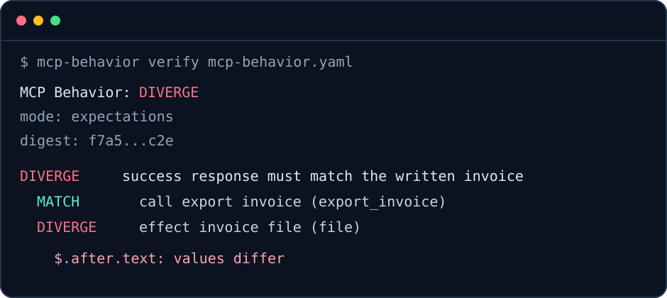

<div align="center">
  
  <h1>MCP Behavior</h1>
  <p>Deterministic regression tests for what MCP tools actually do.</p>

  [](https://github.com/GWeale/mcp-behavior/actions/workflows/ci.yml)
  [](https://pypi.org/project/mcp-behavior/)
  [](https://pypi.org/project/mcp-behavior/)
  [](LICENSE)
</div>

An MCP tool schema describes an interface. It cannot tell you whether a migration changed the returned values, wrote a different file, or updated the wrong database row. MCP Behavior runs named scenarios and compares the results plus any effects you explicitly observe.

It supports three workflows:

| Workflow | What it compares |
|---|---|
| Expectations | One live target against assertions in YAML |
| Baseline | One live target against a reviewed JSON recording |
| Differential | A candidate and reference MCP server against each other |

Every run ends as `MATCH`, `DIVERGE`, or `INCONCLUSIVE`. The process exits with code 0, 1, or 2 respectively. Uncertainty never passes as a match.

<p align="center">
  
</p>

## Install

MCP Behavior requires Python 3.11 or newer.

```bash
pipx install mcp-behavior
```

You can also run it without a persistent install:

```bash
uvx mcp-behavior --help
```

## First verification

Create a starter contract:

```bash
mcp-behavior init
```

Point the target at your server, then describe one call:

```yaml
version: 1
name: inventory-server

targets:
  candidate:
    transport: stdio
    command: [python, server.py]
    workspace: .mcp-behavior/workspace

scenarios:
  - name: lookup returns the requested item
    tags: [smoke]
    calls:
      - name: lookup one item
        tool: lookup
        arguments:
          item_id: item-42
        expect:
          outcome: success
          paths_equal:
            $.structuredContent.id: item-42
```

Run it:

```bash
mcp-behavior verify mcp-behavior.yaml
```

The evidence directory contains a canonical manifest, the observations, field-level differences, declared effects, and bounded logs. Values that came from sensitive environment variables or headers are redacted before anything is written.

## Record a baseline

Add `baseline: baseline.json` to the contract and omit inline expectations where you want a full recording.

```bash
mcp-behavior record mcp-behavior.yaml
git diff -- baseline.json
mcp-behavior verify mcp-behavior.yaml
```

Review baseline changes like code. Each baseline has a semantic SHA-256 digest, and verification rejects a corrupted or hand-edited file whose digest no longer matches.

## Compare two live servers

Declare both `reference` and `candidate` targets. Use separate workspaces when a scenario runs commands or observes effects.

```bash
mcp-behavior diff mcp-behavior.yaml --format markdown --output report.md
```

The [differential example](examples/differential/) intentionally renames a response field so you can see a useful failure.

## Observable effects

Calls can be paired with explicit observers:

- `file` captures a file's state, UTF-8 content or base64 bytes, size, and digest.
- `tree` records a sorted directory tree without following symlinks.
- `sqlite` runs a read-only `SELECT` or `WITH` query and caps the result at 1,000 rows.
- `command` runs a trusted custom probe with a versioned JSON stdin/stdout contract.

An observer can capture the state after a call or a delta from before to after. Paths are resolved inside the target workspace unless you declare an absolute root. Relative traversal outside that root is rejected.

## Comparison controls

The default comparison is structural JSON. A call or observer can choose exact, text, bytes, or JSON comparison; set numeric tolerance; and mark specific arrays as unordered. Normalization is always declared in the contract. Available rules include JSON-path removal, redaction, replacement, and narrow built-ins for timestamps, UUIDs, request IDs, ports, and temporary paths.

MCP Behavior accepts a strict JSON-path subset:

```text
$.result.items[0].id
$._meta['io.modelcontextprotocol/serverInfo']
```

Unsupported syntax fails during contract loading instead of being ignored.

## CI

JSON, Markdown, and JUnit reports are available alongside terminal output.

```bash
mcp-behavior verify mcp-behavior.yaml \
  --format junit \
  --output .mcp-behavior/report.xml
```

The repository also includes a composite GitHub Action:

```yaml
- uses: GWeale/mcp-behavior@v0.1.0
  with:
    contract: mcp-behavior.yaml
    report: .mcp-behavior/report.xml
```

See [CI setup](docs/CI.md) for artifact upload and test-report publishing examples.

## Security boundary

Configured MCP servers, setup and cleanup commands, and custom probes execute as trusted local code. Process-group cleanup, timeouts, output limits, path containment, read-only SQLite connections, and secret redaction reduce mistakes. They do not make hostile code safe. Run untrusted servers in a container, VM, or CI job with an appropriate sandbox.

No telemetry or model calls are built into MCP Behavior.

## What this project covers

MCP Behavior focuses on executed values and declared effects. Use the official MCP Inspector for interactive protocol debugging, the MCP conformance suite for protocol compliance, `mcp-contracts` for schema compatibility, and `mcp-lock` for package integrity. The [positioning note](docs/POSITIONING.md) records the boundary and links to those projects.

## Documentation

- [Contract reference](docs/CONTRACT.md)
- [Evidence and reproducibility](docs/EVIDENCE.md)
- [Security model](docs/SECURITY.md)
- [CI and GitHub Action](docs/CI.md)
- [GitHub publication checklist](docs/PUBLICATION_CHECKLIST.md)
- [Architecture decisions](docs/adr/)
- [Contributing](CONTRIBUTING.md)

The project is preparing its first alpha release. Contract and evidence schemas are versioned; backward compatibility starts with the first published release.
