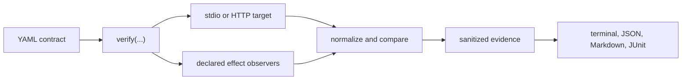

<div align="center">
  <picture>
    <source media="(prefers-color-scheme: dark)" srcset="docs/assets/logo-dark.svg">
    
  </picture>
  <h1>MCP Behavior</h1>
  <p>Parity tests for MCP migrations, including returned values and observable side effects.</p>

  [](https://github.com/GWeale/mcp-behavior/actions/workflows/ci.yml)
  [](https://www.python.org/downloads/)
  [](LICENSE)
</div>

An MCP tool schema can remain unchanged while a rewrite returns a different business value, writes the wrong file, or updates the wrong database row. MCP Behavior runs the same named scenario against the old and new servers, then compares the results plus any effects you explicitly observe.

It supports three workflows:

| Workflow | What it compares |
|---|---|
| Differential | A candidate and reference MCP server against each other |
| Baseline | One live target against a reviewed JSON recording |
| Expectations | One live target against assertions in YAML |

Every run ends as `MATCH`, `DIVERGE`, or `INCONCLUSIVE`. The process exits with code 0, 1, or 2 respectively. Uncertainty never passes as a match.

## The regression a schema check misses

Both implementations below satisfy the same `lookup(user_id) -> {id: str, status: str}` shape:

```diff
  {
    "id": "user-42",
-   "status": "active"
+   "status": "suspended"
  }
```

MCP Behavior runs both servers and reports the first semantic difference:

```text
DIVERGE      schema-compatible lookup value stays stable
  DIVERGE      call known user (lookup)
    $.structuredContent.status: values differ
```

The runnable [differential example](examples/differential/) produces this result with exit code 1.

<p align="center">
  
</p>

## Install

MCP Behavior requires Python 3.11 or newer. Until the first package release, install the current alpha directly from GitHub:

```bash
pipx install git+https://github.com/GWeale/mcp-behavior.git
```

You can also run it without a persistent install:

```bash
uvx --from git+https://github.com/GWeale/mcp-behavior.git mcp-behavior --help
```

## 60-second quickstart

Create a starter contract:

```bash
mcp-behavior init
```

Point the target at your server, then describe one call:

```yaml
version: 1
name: inventory-server

targets:
  candidate:
    transport: stdio
    command: [python, server.py]
    workspace: .mcp-behavior/workspace

scenarios:
  - name: lookup returns the requested item
    tags: [smoke]
    calls:
      - name: lookup one item
        tool: lookup
        arguments:
          item_id: item-42
        expect:
          outcome: success
          paths_equal:
            $.structuredContent.id: item-42
```

Run it:

```bash
mcp-behavior verify mcp-behavior.yaml
```

The evidence directory contains a canonical manifest, the observations, field-level differences, declared effects, and bounded logs. Values that came from sensitive environment variables or headers are redacted before anything is written.

Use `--diff-detail full` for every field-level difference, `--quiet` for one verdict line, or `--verbose` for sanitized values and timings.

## Record a baseline

Add `baseline: baseline.json` to the contract and omit inline expectations where you want a full recording.

```bash
mcp-behavior record mcp-behavior.yaml
git diff -- baseline.json
mcp-behavior verify mcp-behavior.yaml
```

Review baseline changes like code. Each baseline has a semantic SHA-256 digest, and verification rejects a corrupted or hand-edited file whose digest no longer matches.

## Compare two live servers

Declare both `reference` and `candidate` targets. Use separate workspaces when a scenario runs commands or observes effects.

```bash
mcp-behavior diff mcp-behavior.yaml --format markdown --output report.md
```

The [differential example](examples/differential/) intentionally renames a response field so you can see a useful failure.

## Observable effects

Calls can be paired with explicit observers:

- `file` captures a file's state, UTF-8 content or base64 bytes, size, and digest.
- `tree` records a sorted directory tree without following symlinks.
- `sqlite` runs a read-only `SELECT` or `WITH` query and caps the result at 1,000 rows.
- `command` runs a trusted custom probe with a versioned JSON stdin/stdout contract.

An observer can capture the state after a call or a delta from before to after. Paths are resolved inside the target workspace unless you declare an absolute root. Relative traversal outside that root is rejected.

The [wrong-effect example](examples/wrong-effect/) returns success from the MCP tool but writes the wrong invoice total. The call matches and the file observer diverges.

## Comparison controls

The default comparison is structural JSON. `exact` compares type and value at the root. `text` reports changed line regions. `bytes` decodes file observation envelopes and reports the first changed byte. JSON comparison supports numeric tolerance and explicitly unordered arrays.

Normalization is always declared in the contract. Available rules include JSON-path removal, redaction, replacement, and narrow built-ins for timestamps, UUIDs, request IDs, ports, and temporary paths. The [nondeterminism example](examples/nondeterminism/) proves that normalized runtime noise has a stable semantic digest and that an abrupt server exit becomes `INCONCLUSIVE`.

MCP Behavior accepts a strict JSON-path subset:

```text
$.result.items[0].id
$._meta['io.modelcontextprotocol/serverInfo']
```

Unsupported syntax fails during contract loading instead of being ignored.

## CI

JSON, Markdown, and JUnit reports are available alongside terminal output.

```bash
mcp-behavior verify mcp-behavior.yaml \
  --format junit \
  --output .mcp-behavior/report.xml
```

The repository also includes a composite GitHub Action:

```yaml
- uses: GWeale/mcp-behavior@main
  with:
    contract: mcp-behavior.yaml
    report: .mcp-behavior/report.xml
```

`main` is the alpha channel until the first versioned release. Pin a commit SHA if your CI requires an immutable action reference.

See [CI setup](docs/CI.md) for artifact upload and test-report publishing examples.

## Security boundary

Configured MCP servers, setup and cleanup commands, and custom probes execute as trusted local code. Process-group cleanup, timeouts, output limits, path containment, read-only SQLite connections, and secret redaction reduce mistakes. They do not make hostile code safe. Run untrusted servers in a container, VM, or CI job with an appropriate sandbox.

No telemetry or model calls are built into MCP Behavior.

## Architecture



The verification core owns connection management, ordering, time budgets, cleanup, normalization, verdicts, and evidence. Transport and observer implementations stay behind internal seams. See [the architecture reference](docs/ARCHITECTURE.md).

## Examples

| Example | Demonstrates | Expected result |
|---|---|---:|
| [Expectations](examples/expectations/) | direct call and file assertions | `MATCH` / 0 |
| [Baseline](examples/baseline/) | reviewed recording and numeric tolerance | `MATCH` / 0 |
| [Value drift](examples/differential/) | same schema, changed business value | `DIVERGE` / 1 |
| [Wrong effect](examples/wrong-effect/) | success response, incorrect file | `DIVERGE` / 1 |
| [Nondeterminism](examples/nondeterminism/) | explicit normalization and abrupt exit | `INCONCLUSIVE` / 2 |

## What this project covers

MCP Behavior focuses on parity during an MCP server migration: run the same workflow against two implementations and compare returned values plus declared state changes. Use the official MCP Inspector for interactive exploration and general scripted calls, the conformance suite for protocol compliance, MCP Test Harness for broad code-first server testing, `mcp-contracts` for schema compatibility, and `mcp-lock` for package integrity. The [positioning note](docs/POSITIONING.md) records the boundary and links to those projects.

## Documentation

- [Contract reference](docs/CONTRACT.md)
- [CLI reference](docs/CLI.md)
- [Python API](docs/API.md)
- [Architecture](docs/ARCHITECTURE.md)
- [Normalization](docs/NORMALIZATION.md)
- [Observable effects](docs/EFFECTS.md)
- [Evidence and reproducibility](docs/EVIDENCE.md)
- [Compatibility matrix](docs/COMPATIBILITY.md)
- [Troubleshooting](docs/TROUBLESHOOTING.md)
- [Security model](docs/SECURITY.md)
- [CI and GitHub Action](docs/CI.md)
- [Brand assets](docs/BRAND.md)
- [Provenance and license audit](docs/PROVENANCE.md)
- [v0.1.0 requirement audit](docs/RELEASE_AUDIT.md)
- [GitHub publication checklist](docs/PUBLICATION_CHECKLIST.md)
- [Architecture decisions](docs/adr/)
- [Roadmap](ROADMAP.md)
- [Contributor issue drafts](docs/CONTRIBUTOR_ISSUES.md)
- [Contributing](CONTRIBUTING.md)

This repository is an alpha. Contract and evidence schemas are versioned; backward compatibility starts with the first versioned release.
