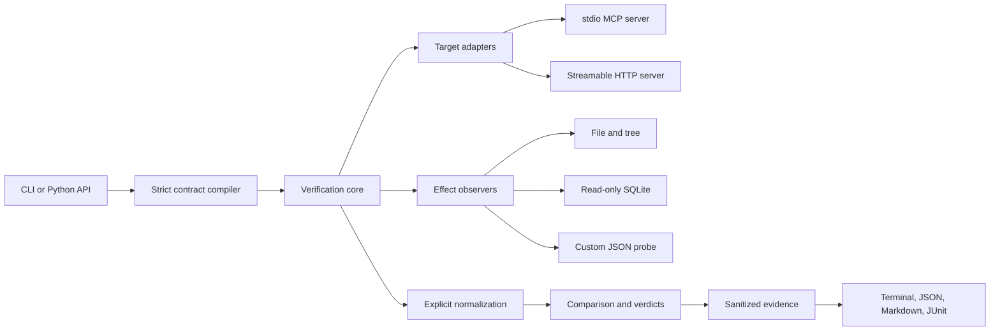

# Architecture

MCP Behavior has one orchestration boundary: `verify(...)`. Callers provide a contract and an evidence directory. The core owns the rest of the run.



## Public seam

The synchronous API is deliberately small:

```python
report = verify(contract_path, evidence_dir, target_overrides=None)
```

The returned `VerificationReport` contains typed scenario, call, effect, difference, and verdict records. `verify_async(...)` provides the same contract when the caller already owns an event loop.

## Module responsibilities

| Module | Owns | Does not own |
|---|---|---|
| `contract` | safe YAML loading, defaults, validation, paths, literal variables | process or network I/O |
| `core` | lifecycle, ordering, time budget, verdict aggregation, sanitization | MCP wire details |
| `targets` | official-SDK stdio and HTTP connections | comparison policy |
| `effects` | bounded observations and filesystem containment | target lifecycle |
| `normalization` | explicit transforms, canonical JSON, secret defense | assertions |
| `comparison` | exact, JSON, text, bytes, subset, and path checks | persistence |
| `evidence` | deterministic semantic manifests and non-semantic run details | report presentation |
| `reports` | terminal and machine-readable renderers | execution |

The stdio and HTTP adapters occupy a real transport seam. File, tree, SQLite, and command observers occupy a real observation seam. v0.1 does not expose a third-party plugin API because no stable external seam has been proven yet.

## Run lifecycle

For each selected scenario and target, the core runs setup commands, captures any before-state, connects the MCP client, executes tool calls in contract order, closes the connection, captures after-state, and runs cleanup. Cleanup also runs after a partial failure. Differential mode completes the reference run before the candidate run, using separate workspaces when the scenario can mutate state.

## Evidence invariant

Raw target values stay in memory only long enough to normalize and sanitize them. Persistent evidence receives normalized, sanitized values. Durations and local paths live in `run.json`; they never enter the semantic digest. The same deterministic behavior therefore produces the same `manifest.json` digest on machines with different speeds or checkout paths.

The consequential choices are recorded in [the ADR directory](adr/).
